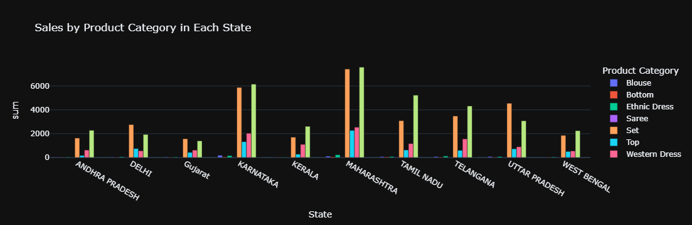

# Amazon E-Commerce Sales Data Analysis
By @Onkar_Kasture
## Table of Contents
- [Introduction](#introduction)
- [Importing Necessary Modules](#import-necessary-modules)
- [Importing Data with Pandas](#importing-data-with-pandas)
- [Data Cleaning](#data-cleaning)
  - [Renaming the Columns](#lets-rename-the-columns-to-be-more-coding-friendly)
  - [Changing Datatypes](#lets-change-the-data-types-of-some-columns)
  - [Removing Unecessary Columns](#lets-remove-the-unnecessary-columns)
  - [Removing Duplicates](#lets-remove-any-duplicates)
  - [Fixing Missing Values](#lets-fill-up-the-empty-or-null-values)
- [Data Wrangling](#data-wrangling)
- [Data Visualization](#data-visualization)
  - [Month on Month Revenue Trend](#month-on-month-revenue-trend)
  - [Category Wise Revenue](#category-wise-revenue)
  - [Category Wise Average Amount Spent](#category-wise-average-amount)
  - [Size wise Sales Quantity](#size-wise-sales-qty)
  - [Category wise Order Status](#category-wise-order-status)
  - [Sales by Product Category in each State](#sales-by-product-categories-in-each-state)
- [Conclusion](#conclusion)


## Introduction
This project focuses on analyzing Amazon's E-Commerce sales data on clothing to gain insights into sales trends, product performance, and other relevant metrics. Python and popular data analysis libraries such as pandas, matplotlib, seaborn, and plotly are utilized for data processing, visualization, and analysis.
Here's the jupyter notebook that you can refer for actual code: [Link](/Amazon_sales_analysis.ipynb)

### Import necessary modules
```python
import pandas as pd
import matplotlib.pyplot as plt
import seaborn as sns
import plotly.express as px
import numpy as np
```

### Importing data with pandas

``` python

dataset = pd.read_csv('Amazon_sales_report.csv', low_memory=False)

dataset.head()
```


<div>
<style scoped>
    .dataframe tbody tr th:only-of-type {
        vertical-align: middle;
    }

    .dataframe tbody tr th {
        vertical-align: top;
    }

    .dataframe thead th {
        text-align: right;
    }
</style>
<table border="1" class="dataframe">
  <thead>
    <tr style="text-align: right;">
      <th></th>
      <th>index</th>
      <th>Order ID</th>
      <th>Date</th>
      <th>Status</th>
      <th>Fulfilment</th>
      <th>Sales Channel</th>
      <th>ship-service-level</th>
      <th>Style</th>
      <th>SKU</th>
      <th>Category</th>
      <th>...</th>
      <th>currency</th>
      <th>Amount</th>
      <th>ship-city</th>
      <th>ship-state</th>
      <th>ship-postal-code</th>
      <th>ship-country</th>
      <th>promotion-ids</th>
      <th>B2B</th>
      <th>fulfilled-by</th>
      <th>Unnamed: 22</th>
    </tr>
  </thead>
  <tbody>
    <tr>
      <th>0</th>
      <td>0</td>
      <td>405-8078784-5731545</td>
      <td>04-30-22</td>
      <td>Cancelled</td>
      <td>Merchant</td>
      <td>Amazon.in</td>
      <td>Standard</td>
      <td>SET389</td>
      <td>SET389-KR-NP-S</td>
      <td>Set</td>
      <td>...</td>
      <td>INR</td>
      <td>647.62</td>
      <td>MUMBAI</td>
      <td>MAHARASHTRA</td>
      <td>400081.0</td>
      <td>IN</td>
      <td>NaN</td>
      <td>False</td>
      <td>Easy Ship</td>
      <td>NaN</td>
    </tr>
    <tr>
      <th>1</th>
      <td>1</td>
      <td>171-9198151-1101146</td>
      <td>04-30-22</td>
      <td>Shipped - Delivered to Buyer</td>
      <td>Merchant</td>
      <td>Amazon.in</td>
      <td>Standard</td>
      <td>JNE3781</td>
      <td>JNE3781-KR-XXXL</td>
      <td>kurta</td>
      <td>...</td>
      <td>INR</td>
      <td>406.00</td>
      <td>BENGALURU</td>
      <td>KARNATAKA</td>
      <td>560085.0</td>
      <td>IN</td>
      <td>Amazon PLCC Free-Financing Universal Merchant ...</td>
      <td>False</td>
      <td>Easy Ship</td>
      <td>NaN</td>
    </tr>
    <tr>
      <th>2</th>
      <td>2</td>
      <td>404-0687676-7273146</td>
      <td>04-30-22</td>
      <td>Shipped</td>
      <td>Amazon</td>
      <td>Amazon.in</td>
      <td>Expedited</td>
      <td>JNE3371</td>
      <td>JNE3371-KR-XL</td>
      <td>kurta</td>
      <td>...</td>
      <td>INR</td>
      <td>329.00</td>
      <td>NAVI MUMBAI</td>
      <td>MAHARASHTRA</td>
      <td>410210.0</td>
      <td>IN</td>
      <td>IN Core Free Shipping 2015/04/08 23-48-5-108</td>
      <td>True</td>
      <td>NaN</td>
      <td>NaN</td>
    </tr>
    <tr>
      <th>3</th>
      <td>3</td>
      <td>403-9615377-8133951</td>
      <td>04-30-22</td>
      <td>Cancelled</td>
      <td>Merchant</td>
      <td>Amazon.in</td>
      <td>Standard</td>
      <td>J0341</td>
      <td>J0341-DR-L</td>
      <td>Western Dress</td>
      <td>...</td>
      <td>INR</td>
      <td>753.33</td>
      <td>PUDUCHERRY</td>
      <td>PUDUCHERRY</td>
      <td>605008.0</td>
      <td>IN</td>
      <td>NaN</td>
      <td>False</td>
      <td>Easy Ship</td>
      <td>NaN</td>
    </tr>
    <tr>
      <th>4</th>
      <td>4</td>
      <td>407-1069790-7240320</td>
      <td>04-30-22</td>
      <td>Shipped</td>
      <td>Amazon</td>
      <td>Amazon.in</td>
      <td>Expedited</td>
      <td>JNE3671</td>
      <td>JNE3671-TU-XXXL</td>
      <td>Top</td>
      <td>...</td>
      <td>INR</td>
      <td>574.00</td>
      <td>CHENNAI</td>
      <td>TAMIL NADU</td>
      <td>600073.0</td>
      <td>IN</td>
      <td>NaN</td>
      <td>False</td>
      <td>NaN</td>
      <td>NaN</td>
    </tr>
  </tbody>
</table>
<p>5 rows × 24 columns</p>
</div>


### Data Cleaning

#### Let's rename the columns to be more coding friendly.
``` python
dataset.columns = dataset.columns.str.lower().str.replace('-', '_').str.strip().str.replace(' ', '_')
```
#### Let's change the data types of some columns
``` python
dataset.date = pd.to_datetime(dataset.date)
dataset.info()
```
```
    <class 'pandas.core.frame.DataFrame'>
    RangeIndex: 128975 entries, 0 to 128974
    Data columns (total 24 columns):
     #   Column              Non-Null Count   Dtype         
    ---  ------              --------------   -----         
     0   index               128975 non-null  int64         
     1   order_id            128975 non-null  object        
     2   date                128975 non-null  datetime64[ns]
     3   status              128975 non-null  object        
     4   fulfilment          128975 non-null  object        
     5   sales_channel       128975 non-null  object        
     6   ship_service_level  128975 non-null  object        
     7   style               128975 non-null  object        
     8   sku                 128975 non-null  object        
     9   category            128975 non-null  object        
     10  size                128975 non-null  object        
     11  asin                128975 non-null  object        
     12  courier_status      122103 non-null  object        
     13  qty                 128975 non-null  int64         
     14  currency            121180 non-null  object        
     15  amount              121180 non-null  float64       
     16  ship_city           128942 non-null  object        
     17  ship_state          128942 non-null  object        
     18  ship_postal_code    128942 non-null  float64       
     19  ship_country        128942 non-null  object        
     20  promotion_ids       79822 non-null   object        
     21  b2b                 128975 non-null  bool          
     22  fulfilled_by        39277 non-null   object        
     23  unnamed:_22         79925 non-null   object        
    dtypes: bool(1), datetime64[ns](1), float64(2), int64(2), object(18)
    memory usage: 22.8+ MB
```
Let's quickly get a general overview of the values that we have in the columns
``` python
dataset.apply(pd.unique)
```
```
    index                 [0, 1, 2, 3, 4, 5, 6, 7, 8, 9, 10, 11, 12, 13,...
    order_id              [405-8078784-5731545, 171-9198151-1101146, 404...
    date                  [2022-04-30T00:00:00.000000000, 2022-04-29T00:...
    status                [Cancelled, Shipped - Delivered to Buyer, Ship...
    fulfilment                                           [Merchant, Amazon]
    sales_channel                                   [Amazon.in, Non-Amazon]
    ship_service_level                                [Standard, Expedited]
    style                 [SET389, JNE3781, JNE3371, J0341, JNE3671, SET...
    sku                   [SET389-KR-NP-S, JNE3781-KR-XXXL, JNE3371-KR-X...
    category              [Set, kurta, Western Dress, Top, Ethnic Dress,...
    size                   [S, 3XL, XL, L, XXL, XS, 6XL, M, 4XL, 5XL, Free]
    asin                  [B09KXVBD7Z, B09K3WFS32, B07WV4JV4D, B099NRCT7...
    courier_status                     [nan, Shipped, Cancelled, Unshipped]
    qty                                    [0, 1, 2, 15, 3, 9, 13, 5, 4, 8]
    currency                                                     [INR, nan]
    amount                [647.62, 406.0, 329.0, 753.33, 574.0, 824.0, 6...
    ship_city             [MUMBAI, BENGALURU, NAVI MUMBAI, PUDUCHERRY, C...
    ship_state            [MAHARASHTRA, KARNATAKA, PUDUCHERRY, TAMIL NAD...
    ship_postal_code      [400081.0, 560085.0, 410210.0, 605008.0, 60007...
    ship_country                                                  [IN, nan]
    promotion_ids         [nan, Amazon PLCC Free-Financing Universal Mer...
    b2b                                                       [False, True]
    fulfilled_by                                           [Easy Ship, nan]
    unnamed:_22                                                [nan, False]
    dtype: object
```

We can remove several unnecessary columns and the index column for our analysis though do note that the might be useful in other context. These include **'sku', 'asin', 'sales_channel', 'promotion_ids', 'style', 'fulfilled_by', 'Unnamed:_22', 'ship_country', and 'currency'**. Since Python and pandas automatically generate an index, we don't need to keep the **index column**.
#### Let's remove the unnecessary columns.


``` python
dataset.drop(['sku', 'asin', 'promotion_ids', 'fulfilled_by', 'unnamed:_22', 'ship_country', 'currency', 'style', 'sales_channel', 'index'], axis=1, inplace=True)
```

``` python
dataset.groupby(dataset.date.dt.month).amount.sum()
# Here we can see that march month is an outlier with relatively very small revenue, so it's better to just remove it.
dataset.drop(dataset[dataset.date.dt.month==3].index, axis=0, inplace=True)
```
#### Let's remove any duplicates
``` python
duplicates = dataset[dataset.duplicated()]
dataset.drop_duplicates(inplace=True)
print(f'Found {len(duplicates)} duplicate rows and removed them') if not duplicates.empty else print('Found 0 duplicate rows and removed them')
```

**Found 785 duplicate rows and removed them**

I see many null values in the rows, let's get an overview of how many we have with better visualization.
``` python
sns.heatmap(data=dataset.isnull(), cbar=False);
```


The bright colored spots are the NULL or Missing values. 

#### Let's fill up the empty or null values.
``` python
dataset.courier_status = dataset.courier_status.fillna(value='unknown')
dataset.amount = dataset.amount.fillna(value=0)
dataset.ship_city = dataset.ship_city.fillna(value='unknown')
dataset.ship_state = dataset.ship_state.fillna(value='unknown')
dataset.ship_postal_code = dataset.ship_postal_code.fillna(value='unknown')
```
Let's check if it worked or not.
``` python
sns.heatmap(data=dataset.isnull(), cbar=False);
```


**We are good to go!**

# Data Wrangling
In order to make our life easier while trying to visualise data let's add a separate month column with respective month name based on order date.
``` python
dataset.date.dt.month.unique()

months = ['April', 'May', 'June']
dataset['month'] = dataset.date.dt.month.replace(4, 'April').replace(5, 'May').replace(6, 'June')
```
Now we have a month column but if we sort these values by month it will be alphabetical sort not categorical, so let's define it as categorical data type.
``` python
dataset['month'] = pd.Categorical(dataset['month'], categories=months, ordered=True)

# Same goes for Sizes
dataset['size'].unique()
sizes = ['XS', 'S', 'M', 'L', 'XL', 'XXL', '3XL', '4XL', '5XL', '6XL', 'Free']
dataset['size'] = pd.Categorical(dataset['size'], categories=sizes, ordered=True)
```

We can combine multiple different order status into one, like **shipped -
out for delivery** and **shipped** are basically the same within the context
of this analysis. 
#### So let\'s categorise them better.

``` python
replacements = {'Shipped - Delivered to Buyer': 'Delivered',
               'Shipped - Returned to Seller':'Cancelled',
               'Shipped - Out for Delivery':'Shipped',
               'Shipped - Returning to Seller':'Cancelled',
               'Shipped - Rejected by Buyer':'Cancelled',
               'Shipped - Picked Up': 'Shipped'}
dataset.status = dataset.status.replace(replacements)
```
With this our data wrangling is complete and we can move on the fun part of data visualization!
# Data visualization
Let's just make sure we don't have any null values in any of the columns.
``` python
dataset.isnull().sum()
# All Clear!
```

    order_id              0
    date                  0
    status                0
    fulfilment            0
    ship_service_level    0
    category              0
    size                  0
    courier_status        0
    qty                   0
    amount                0
    ship_city             0
    ship_state            0
    ship_postal_code      0
    b2b                   0
    month                 0
    dtype: int64

### Month on month revenue trend

``` python
monthly_revenue = dataset.groupby('month', observed=False).amount.sum()
px.bar(monthly_revenue, template='plotly_dark').update_layout(showlegend=False).update_yaxes(range=[18000000,monthly_revenue.max()])
```

The data is not really sufficient to comment decisively on the trend but based on what we do have, the monthly trend seems to be a gradual decrease.

### Category wise revenue

``` python
percent_revenue = (dataset.groupby('category', observed=False).amount.sum()*100/dataset.groupby('category', observed=False).amount.sum().sum()).sort_values()
percent_plot = px.line(percent_revenue, markers=True, template='plotly_dark', title='Category wise Revenue', labels={'value':'Percentage Revenue', 'category':'Category'})
percent_plot.add_annotation(
    x=percent_revenue.index[-1],
    y=percent_revenue.max(),
    xref="x",
    yref="y",
    text="Top Category Revenue Wise",
    showarrow=True,
    font=dict(
        color="cyan",
        size=12
    )
)
percent_plot.update_traces(name='Revenue')
percent_plot.show()

top_cat_pr = percent_revenue.values.max()
top_cat = percent_revenue[percent_revenue.values==top_cat_pr].index[0]
print(f'The best performing category among all the clothing categories was {top_cat} with {round(top_cat_pr,2)}% share of total revenue.\n')
```


The best performing category among all the clothing categories was **Set** with **49.98%** share of total revenue.

### Category wise average amount

``` python
average_amount = dataset.groupby('category', observed=False).amount.mean().reset_index().sort_values('category', ascending=False)
mean_amount = average_amount['amount'].mean()
average_amount['colors'] = average_amount['amount'].apply(lambda x: 'lime' if x>mean_amount else 'dodgerblue')

fig = px.bar(average_amount, x='category', y='amount', color='colors', title='Category wise Average Amount Spent', template='plotly_dark', 
             labels={'category':'Category', 'amount':'Amount Spent'})
fig.add_shape(type="line",
              x0=-0.5,
              y0=mean_amount,
              x1=len(average_amount) - 0.5,
              y1=mean_amount,
              line=dict(
                  color="cyan",
                  width=3,
                  dash="dash"
              ))

fig.add_annotation(
    x=1,
    y=mean_amount*1.08,
    xref="x",
    yref="y",
    text="Mean of average amount spent",
    showarrow=False,
    font=dict(
        color="cyan",
        size=12
    )
)
fig.for_each_trace(lambda t: t.update(name='Top Categories' if t.name == 'lime' else 'Other Categories'))
fig.update_xaxes(categoryorder='total ascending')
fig.update_layout(hoverlabel_font_color='white')
fig.show()

top_cats = average_amount[average_amount.amount>mean_amount].category.values
print(f'The top performing categories based on average amount spent are {', '.join(top_cats[:-1])} & {top_cats[-1]}\n')
```


The top performing categories based on average amount spent are **Western Dress, Set, Saree & Ethnic Dress**

### Size wise sales qty
``` python
top_sales = dataset[dataset.qty!=0].groupby('size', observed=True).qty.sum().reset_index().sort_values('size')
top_qty = np.percentile(top_sales.qty, [75])
top_sales['colors'] = np.where(top_sales.qty >= np.full(len(top_sales.qty), top_qty), 'lime', 'dodgerblue')
fig = px.bar(top_sales, x='size', y='qty', color = 'colors', template='plotly_dark', title='Size wise Sales Qty', labels={
    'qty':'Sales Qty', 'size':'Size'})
fig.for_each_trace(lambda t: t.update(name='Top Sizes' if t.name == 'lime' else 'Other Sizes'))
fig.add_shape(type="line",
              x0=-0.5,
              y0=top_qty[0],
              x1=len(top_sales['size'])-0.5,
              y1=top_qty[0],
              line=dict(
                  color="cyan",
                  width=3,
                  dash="dash"
              ))

fig.add_annotation(
    x=len(top_sales['size'])-3,
    y=top_qty[0]*1.08,
    xref="x",
    yref="y",
    text="Top 25 Percentile Sales",
    showarrow=False,
    font=dict(
        color="cyan",
        size=12
    ))
fig.update_xaxes(categoryorder='array', categoryarray=['XS', 'S', 'M', 'L', 'XL', 'XXL', '3XL', '4XL', '5XL', '6XL', 'Free'])
fig.show()

top_sizes = top_sales[top_sales['colors']=='lime']['size']
print(f'Among all the sizes the most common (Those in top 25 percentile) seem to be {', '.join(top_sizes.values[:-1])} & {top_sizes.values[-1]}\n')
```


Among all the sizes the most commonly ordered (Those in top 25 percentile) seem to be **M, L & XL**

### Category wise Order Status
``` python
order_status = dataset.groupby(['category','status'], observed=False).size().reset_index(name='count')
custom_colors = ['#1f77b4', '#ff7f0e', '#2ca02c', '#d62728', '#9467bd', '#8c564b', '#e377c2', '#7f7f7f', '#bcbd22', '#17becf']

fig = px.bar(order_status, x='category', y='count', barmode='stack', color='status', template='plotly_dark', title='Category wise Order Status')
fig.update_layout(hoverlabel_font_color='white')
fig.show()

cancelled_orders = order_status[order_status.status.str.contains('Cancelled')]
max_cancelled = cancelled_orders.loc[cancelled_orders['count'].idxmax()]
print(f'A total of {cancelled_orders['count'].sum()} orders or {round((cancelled_orders['count'].sum()*100/order_status['count'].sum()),2)}% of total orders were cancelled or returned with highest number of cancellations being from {max_cancelled['category']} category.\n')
```


A total of **20148** orders or **15.74%** of total orders were cancelled or returned with highest number of cancellations being from **Set** category.

### Sales by Product Categories in each State
``` python
top_states = dataset.groupby('ship_state').qty.sum().reset_index().sort_values('qty', ascending=False)[:10].ship_state.values
state_cats = dataset[dataset.ship_state.isin(top_states)].groupby(['ship_state', 'category']).qty.sum().reset_index(name='sum')

fig = px.bar(state_cats, x='ship_state', y='sum', color='category', barmode='group',
             template='plotly_dark', title='Sales by Product Category in Each State',
             labels={'qty': 'Sales', 'ship_state': 'State', 'category': 'Product Category'})

fig.show()

top = state_cats[state_cats['sum']==state_cats['sum'].max()]

print(f'Among the top categories throughout the states {''.join(top.ship_state.values)} had highest total orders while also topping in {''.join(top.category.values)} category with total {top['sum'].values[0]} {''.join(top.category.values)}s ordered.\n')
```





Among the top categories throughout the states **MAHARASHTRA** had highest total orders while also topping in **kurta** category with total **7574** kurtas ordered.

# Conclusion
In this Amazon sales data analysis, we started by importing necessary modules and then proceeded to import the dataset using pandas. After an initial inspection, we performed data cleaning tasks such as renaming columns, changing data types, handling missing values, and removing duplicates.

Next, we conducted data wrangling by adding a 'month' column for better visualization, categorized order statuses, and sorted sizes. We then moved on to data visualization where we analyzed trends in monthly revenue, category-wise revenue distribution, average amount spent on different categories, sales quantity by size, order status distribution by category, and sales by product categories in each state.

From the analysis, we observed a gradual decrease in monthly revenue over time. The 'Set' category emerged as the best-performing category, contributing to nearly 50% of total revenue. Western dresses, Sets, Sarees, and Ethnic dresses were identified as top-performing categories based on average amount spent. Additionally, sizes M, L, and XL were the most commonly ordered sizes, and Maharashtra recorded the highest total orders, primarily in the kurta category.

Overall, this analysis provides valuable insights into Amazon sales data, highlighting key trends and performance metrics across different categories and regions. These insights can inform strategic decision-making and help optimize business operations for better performance and customer satisfaction.